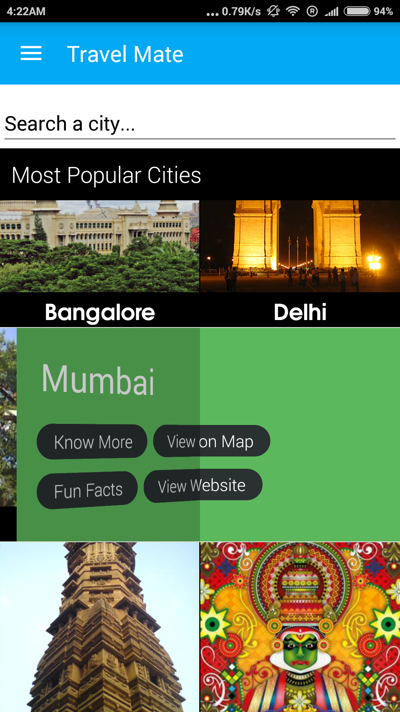
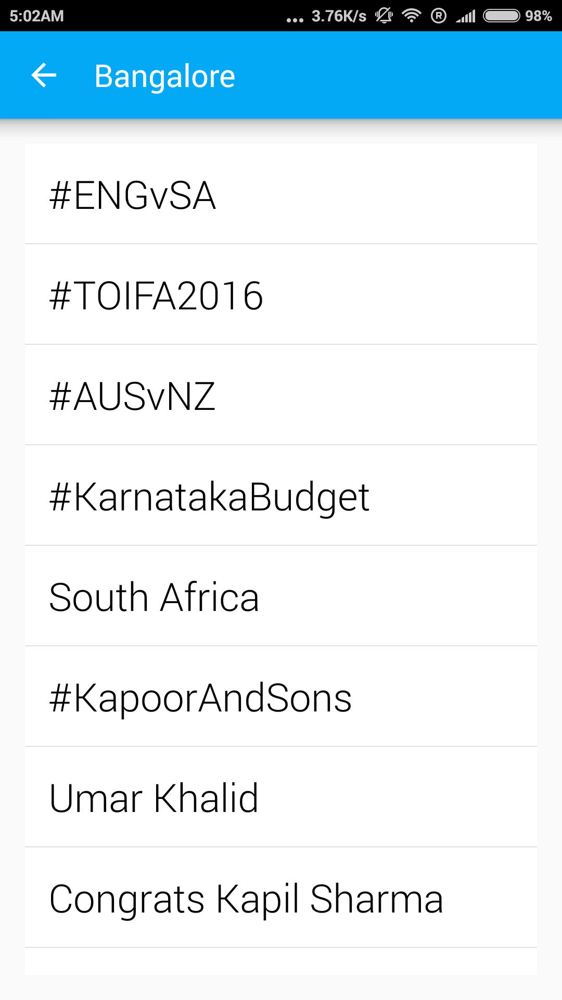

# Travel Mate

  

A must-have app for those interested in travel. The app provides users with various features from **choosing the correct destination** to **making all the bookings** and to **easily organizing the trip**. The platform basically uses a [mash-up technology](https://en.wikipedia.org/wiki/Mashup_(web_application_hybrid)). The app provides solutions for every possible problem a traveller might face during the course of his or her entire journey.

+ **[How Travel Mate Works](#how-travel-mate-works)**
+ **[Select Destination](#select-destination)**
+ **[Travel](#travel)**
  + [My trips](#my-trips)
  + [Hotel Booking](#hotel-booking)
  + [Online Shopping](#online-shopping)
  + [Real Time Locator](#real-time-locator)
+ **[Utilities](#utilities)**
  + [Share contact](#share-contact)
  + [Checklist](#checklist)
+ **[Join us on slack](https://join.slack.com/t/project-travel-mate/shared_invite/enQtNDE2MjgyOTA5ODg5LTgwZGQ3NmY3Y2JjZTIxMWYwMTdkYzZiZmFjMjQ1ZDc1ZmM5NTNkYzQ3M2EwNjVmMzIyYTE4YzRiNjA4ZWRhZDc)**
+ **[Getting Started](#getting-started)**
+ **[Dependencies](#dependencies)**
+ **[Contact Us](#contact-us)**

## How Travel Mate Works

While travelling from one place to another, there are a lot of factors to be considered to make the trip a memorable one. Our platform helps the traveller with anything and everything that he or she might need, from the moment he or she plans the journey till the time he or she is back home happy and content.
The platform includes a wide variety of options - from selection of Mode of Transport, to finding out about the destination city, to provision of best music, novels, depending on the mood of the traveller. Travel Mate basically works in 3 phases.

## Select Destination
A comprehensive list of all the information one would need to know about a city, be it current weather of the city or a list of best hangout places there. Along with the information, the current trend of the city on twitter can also be seen. (It is extracted from Twitter using Twitter and Yahoo! APIs).
Based on this information and the recommendation from the app, user can opt for the preferred destination location.

  

 

## Travel
### My trips
This option allows users to view their travel history, including pictures during each trip, names of accompanying induviduals, and details of expenses for future reference.

  

### Hotel Booking

### Online Shopping

### Real Time Locator
For users travelling in unfamiliar cities, the app also provides real-time information about places around them as they travel through the city, including monuments, restaurants, hotels, medical centres, etc.

 

## Utilities

### Share contact
Users can share their contact details with their co-passengers, by simply sharing the QR code made available on the Travel Mate app.  

### Checklist
The app also includes an interactive checklist of items users need to carry with them on their trips.

### Getting started
Check out the [wiki](https://github.com/project-travel-mate/Travel-Mate/wiki) page to get started with the project.

### Contributing
If you're new to open-source, we recommend you to checkout our [_Contributing Guidelines_](https://github.com/project-travel-mate/Travel-Mate/blob/master/CONTRIBUTING.md) and [Setup Guidelines](https://github.com/project-travel-mate/Travel-Mate/blob/master/SETUP_GUIDELINES.md). Feel free to fork the project and send us a pull request.

## Dependencies
+ [okhttp](https://github.com/square/okhttp)
+ [android-pathview](https://github.com/geftimov/android-pathview)
+ [picasso](https://github.com/square/picasso)
+ [RippleEffect](https://github.com/patrickpissurno/RippleEffect)
+ [ViewPagerTransforms](https://github.com/ToxicBakery/ViewPagerTransforms)
+ [datetimepicker](https://github.com/flavienlaurent/datetimepicker)
+ [MaterialSearchView](https://github.com/MiguelCatalan/MaterialSearchView)
+ [android-process-button](https://github.com/dmytrodanylyk/android-process-button)
+ [butterknife](https://github.com/JakeWharton/butterknife)
+ [Zxing](https://github.com/zxing/zxing)
+ [What's new](https://github.com/TonnyL/WhatsNew)
+ [Notification Badge](https://github.com/nex3z/NotificationBadge)
+ [Search Dialog](https://github.com/mirrajabi/search-dialog)
+ [Timeline View](https://github.com/vipulasri/Timeline-View)
+ [Spotlight](https://github.com/TakuSemba/Spotlight)

## Contact Us

Feel free to [open an issue](https://github.com/Swati4star/Travel-Mate/issues) for any setup query

## Stargazers over time

