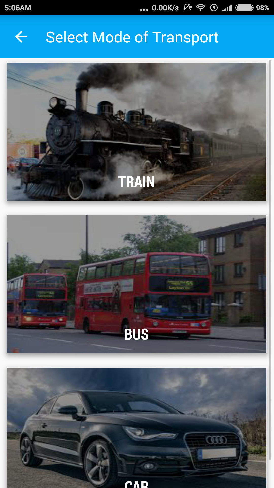
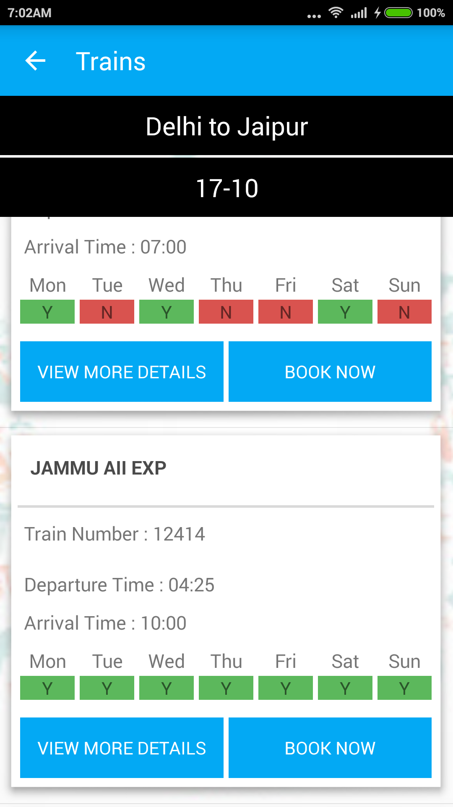
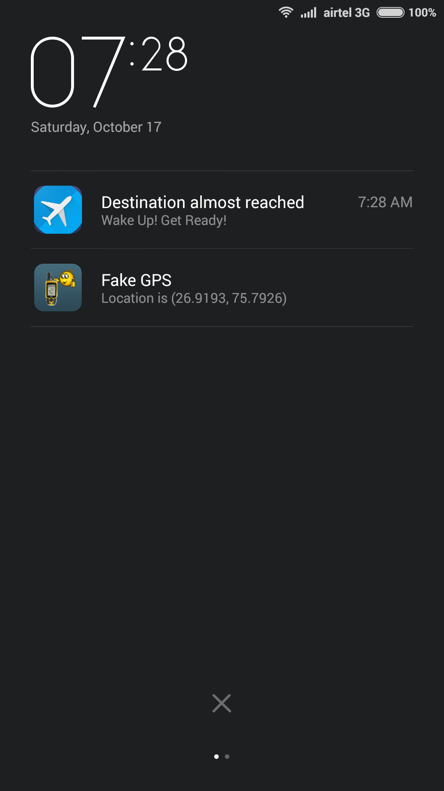
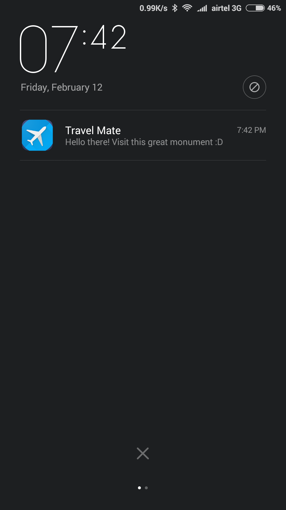
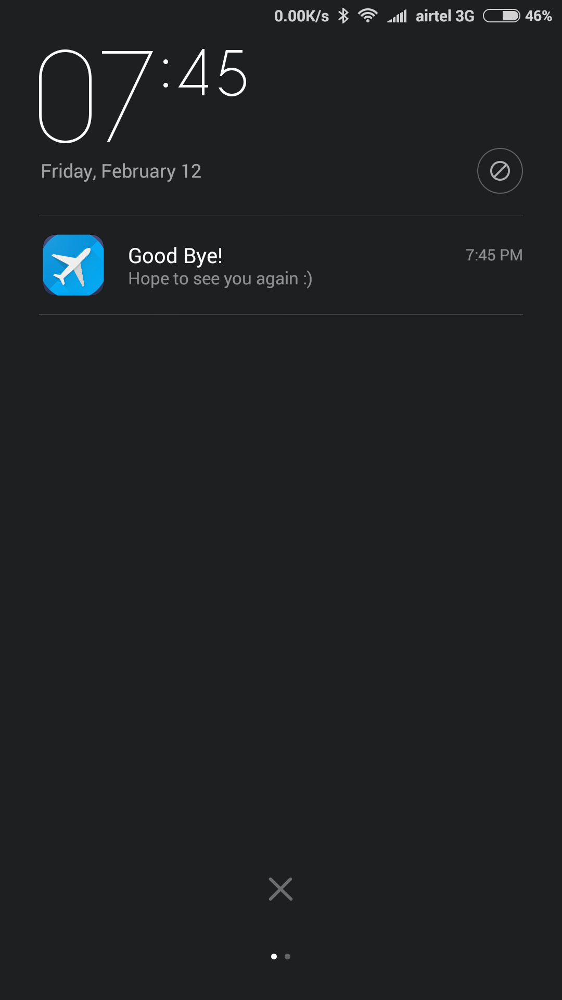
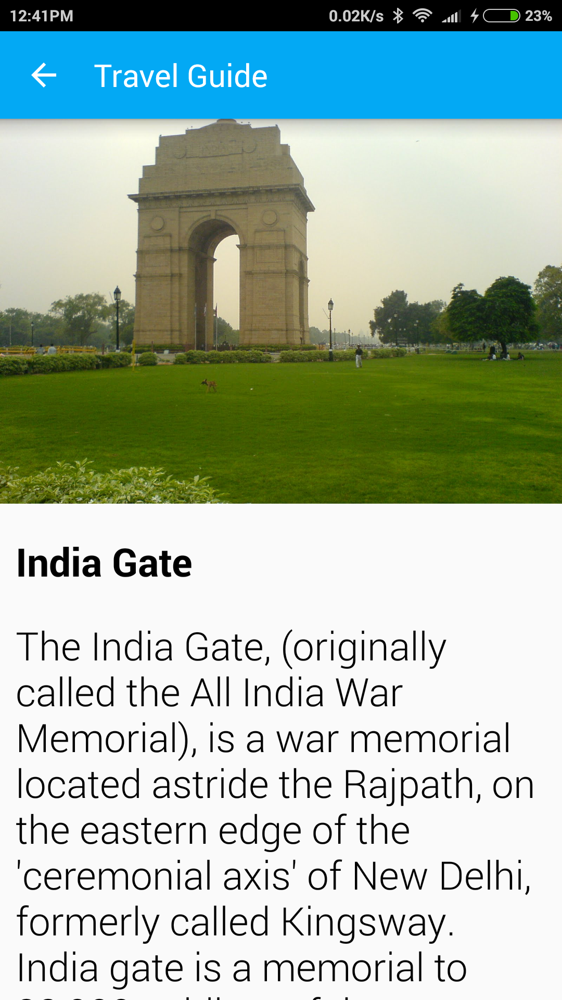

# Travel Mate

A must-have app for those interested in travel. The app provides users with various features from **choosing the correct destination** to **making all the bookings** and to **easily organizing the trip**. The platform basically uses a [mash-up technology](https://en.wikipedia.org/wiki/Mashup_(web_application_hybrid)). The app provides solutions for every possible problem a traveller might face during the course of his or her entire journey.

+ **[How Travel Mate Works](#how-travel-mate-works)**
+ **[Select Destination](#select-destination)**
+ **[Travel](#travel)**
  + [My trips](#my-trips)
  + [Transport](#transport)
  + [Hotel Booking](#hotel-booking)
  + [Online Shopping](#online-shopping)
  + [Real Time Locator](#real-time-locator)
+ **[Utilities](#utilities)**
  + [Share contact](#share-contact)
  + [Checklist](#checklist)
+ **[Push notification](#push-notification)**
+ **[Estimote Beacons](#estimote-beacons)**
+ **[Features](#features)**
  + [Notify the user as soon as he enters proximity](#1notify-the-user-as-soon-as-he-enters-proximity)
  + [Display details of Monument](#2display-details-of-monument)
+ **[Technical Requirements](#technical-requirements)**
+ **[How does Estitmote Beacon work](#how-does-estitmote-beacon-work)**
+ **[Contact Us](#contact-us)**

## How Travel Mate Works

While travelling from one place to another, there are a lot of factors to be considered to make the trip a memorable one. Our platform helps the traveller with anything and everything that he or she might need, from the moment he or she plans the journey till the time he or she is back home happy and content.
The platform includes a wide variety of options - from selection of Mode of Transport, to finding out about the destination city, to provision of best music, novels, depending on the mood of the traveller. Travel Mate basically works in 3 phases. 

## Select Destination
A comprehensive list of all the information one would need to know about a city, be it current weather of the city or a list of best hangout places there. Along with the information, the current trend of the city on twitter can also be seen. (It is extracted from Twitter using Twitter and Yahoo! APIs).
Based on this information and the recommendation from the app, user can opt for the preferred destination location.

  

 

## Travel
### My trips
This option allows users to view their travel history, including pictures during each trip, names of accompanying induviduals, and details of expenses for future reference.

  

### Transport
This option allows users to book bus and railway tickets, using the Travel Mate app. Users opting to travel by car are informed of the total toll and fuel charges they are likely to incur. 

 

### Hotel Booking

### Online Shopping

### Real Time Locator
For users travelling in unfamiliar cities, the app also provides real-time information about places around them as they travel through the city, including monuments, restaurants, hotels, medical centres, etc.

 

## Utilities

### Share contact
Users can share their contact details with their co-passengers, by simply sharing the QR code made available on the Travel Mate app.  

### Checklist
The app also includes an interactive checklist of items users need to carry with them on their trips. 

## Push notification
To prevent users from missing their destination station while travelling by train or bus, the app includes the push notification feature, that sounds an alarm when the users nears their respective destination stations. 
P

## Estimote Beacons
Estimote Beacons are small wireless sensors that can be attached to any location or object. They broadcast tiny radio signals which smartphone can receive and interpret, unlocking micro-location and contextual awareness.

One Estimote beacon is placed in each monument, emitting signals that can be detcted by users' smartphones. The data related to that monument, along with the Estimote beacon ID, are uploaded on the cloud MySQL database.

## Features

### 1.Notify the user as soon as he enters proximity
As soon as the user with Travel Mate app installed comes in proximity (~70m) of a monument (detected by estimote beacon), he  or she will receive a push notification welcoming him. 

 

### 2.Display details of Monument
As soon as the estimote beacon finds a Travel Mate app, it triggers and the phone fetches all the the information about the monument from the cloud and are presented to the traveller. This saves the user the trouble of gathering information about places of interest beforehand.  

## Technical Requirements

Technically, all Bluetooth Smart-enabled android devices could pick up Bluetooth Low Energy signals. The Bluetooth Special Interest Group maintains a [list of devices](https://www.bluetooth.com/what-is-bluetooth-technology/bluetooth-devices) that support Bluetooth Low Energy. These include Android devices like: Samsung Galaxy S devices, Google Nexus, Google Glass and many more.

## How does Estitmote Beacon work

## Contact Us

Feel free to [open an issue](https://github.com/Swati4star/Travel-Mate/issues) for any setup query

## Stargazers over time

      
